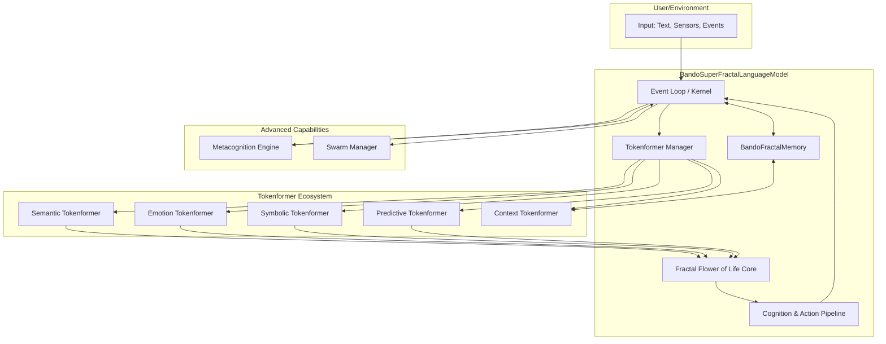
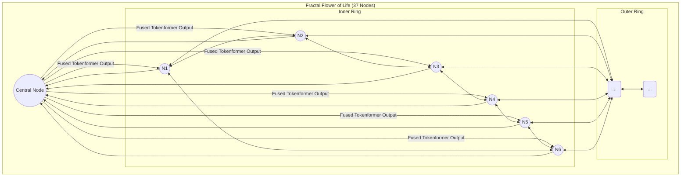

# Plan: The Bando Super Fractal Language Model (Project Chimera)

## 1. Vision & Core Principles

The goal is to create a compact, self-evolving language model with built-in memory, awareness, and emotional comprehension. The architecture is inspired by natural and geometric patterns, specifically the "Flower of Life," and uses principles from quantum theory to achieve true adaptability.

**Core Principles:**

*   **Fractal by Design:** The system is composed of self-similar, recursive components ("nodes" and "tokenformers").
*   **Event-Driven Cognition:** The model operates in a continuous loop, processing external inputs (text, sensors) and internal "thoughts" as events.
*   **Specialized Processing:** Instead of a single monolithic transformer, the model uses a "Tokenformer" ecosystem, where specialized transformers handle different aspects of cognition (semantics, emotion, symbols).
*   **Quantum-Inspired Adaptability:** Parameters are not fixed points but probabilistic distributions, allowing the model to exist in a superposition of states and adapt rapidly.
*   **Metacognitive Evolution:** The model can analyze its own performance and propose modifications to its architecture and parameters.

## 2. High-Level Architecture

The system is composed of several interconnected modules, managed by the `BandoGodcoreKernel`.

## 3. The Fractal Flower of Life Core

This is the central processing unit of the model, replacing the standard sequential stack of transformer blocks. It is a network of 37 interconnected "nodes."

*   **Structure:** Inspired by the Flower of Life pattern, with one central node and multiple layers of interconnected nodes around it.
*   **Nodes:** Each of the 37 nodes is a small, specialized `TransformerOmega` instance.
    *   **Central Node (1):** The primary integration node. It receives inputs from all Tokenformers and broadcasts state to the other nodes.
    *   **Inner Ring Nodes (6):** Specialize in core cognitive functions (e.g., reasoning, short-term memory association).
    *   **Outer Ring Nodes (30):** Handle more specific or abstract tasks, potentially dynamically assigned by the Metacognition Engine.
*   **Information Flow:** Information doesn't just flow sequentially; it propagates through the network, allowing for complex, recursive, and parallel processing.

## 4. The Tokenformer Ecosystem

This ecosystem of specialized transformers preprocesses input and generates rich, multi-faceted representations to feed into the Fractal Core.

1.  **Semantic Tokenformer:** The primary language comprehender. This will be based on the existing `TransformerOmega` and will be responsible for understanding the core meaning of the text.
2.  **Emotion Tokenformer:** A new transformer trained specifically to identify and quantify emotional content in text. Its output will be an "emotion vector" that conditions the generation process, allowing the model to generate text with a specific emotional tone.
3.  **Symbolic Tokenformer:** A transformer designed to process structured, symbolic data like code, mathematical equations, or logical statements. It will excel at tasks requiring formal reasoning.
4.  **Predictive Tokenformer:** A very small, fast transformer that runs ahead of the others, generating speculative predictions about future tokens. This can be used to guide the more powerful models and speed up inference.
5.  **Context Tokenformer:** This transformer interfaces directly with the `BandoFractalMemory`. Its job is to compress long-term memories and retrieve relevant context to be injected into the current processing step.

## 5. Advanced Capabilities & Implementation Plan

### Phase 1: Foundational Layers & Tokenformers

1.  **Extend `OmegaTensor`:** Add new operations as needed (e.g., specialized activation functions, normalization layers).
2.  **Implement the Tokenformers:** Create new Python classes for each of the five Tokenformers. Initially, they can all use the `TransformerOmega` architecture but will be trained on different datasets and for different objectives.
3.  **Create the `TokenformerManager`:** This class will be responsible for routing input to the appropriate Tokenformers and fusing their outputs into a single, rich tensor for the main core.

### Phase 2: The Fractal Flower of Life Core

1.  **Implement the Node Structure:** Define a `FractalNode` class that encapsulates a `TransformerOmega` instance and its connections.
2.  **Build the `FractalFlowerOfLife` Model:** Create the main model class that instantiates the 37 nodes and manages the information flow between them. This will replace the simple list of `TransformerBlock`s in the current `TransformerOmega` model.
3.  **Integrate with `BandoSuperFractalLanguageModel`:** Replace the existing `self.transformer` with an instance of the new `FractalFlowerOfLife` model.

### Phase 3: Self-Evolution and Quantum Adaptability

1.  **Metacognition Engine:** Implement a module that periodically analyzes the model's performance (from the `run_log`). It will have the ability to adjust hyperparameters (`LlamaModelArgs`) and, eventually, propose architectural changes.
2.  **Quantum-Inspired Parameters:** Modify the `Linear` and `Embedding` layers to support `QuantumParameterState`. Instead of a single `OmegaTensor` for weights, they will hold a distribution. The forward pass will sample from this distribution. This will require a new `QuantumOmegaTensor` class or a significant extension of the existing one.
3.  **Swarm Manager:** Create a top-level script or class that can launch and manage multiple instances of the `BandoSuperFractalLanguageModel`, allowing them to communicate and share information.